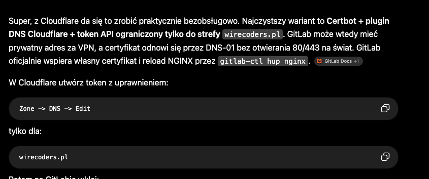

# MiniDV Archiver

Lossless capture and archival of MiniDV / DV tapes over FireWire (IEEE 1394), with a
web dashboard for reviewing what you captured.

The **master is always the raw DV bitstream** — captured with `dvgrab`, split into
scenes on the DV timecode/recording-date breaks, stored as `zstd`-compressed `.dv`
and verified byte-for-byte after compression. Everything else (H.264 proxies, the
whole-tape review file, thumbnails, JSON metadata) is a derivative you can regenerate.



> UI language is Polish; API and docs are English. The dashboard is a
> [TailAdmin](https://github.com/TailAdmin/tailadmin-free-tailwind-dashboard-template)
> layout (MIT) — vendored under `frontend/vendor/`, so **no build step is needed to
> run**. Everything else is configurable via environment variables.

---

## What it does

- **Capture** raw DV from any AV/C MiniDV camcorder or deck (`dvgrab -noavc`), with
  automatic transport control (PLAY/STOP/REW over AV/C) or a fully manual mode.
- **End-of-tape detection** that tolerates blank stretches: keeps waiting (and
  relaunches `dvgrab` if it quits on signal loss) through gaps, stops shortly after
  the recorded material actually ends, and concatenates the segments losslessly.
- **Scene split** on DV discontinuities (`dvgrab -autosplit`).
- **Verified archival**: `sha256` of the raw scene, `zstd` compress, `zstd -t`,
  stream-decompress and compare the hash — the original `.dv` is only deleted once
  the `.dv.zst` reproduces it exactly.
- **Derivatives**: per-scene H.264/AAC MP4 proxy, one continuous `tape.mp4` (stream
  copy of the proxies), thumbnails, and rich `*.json` (timecode, recording date from
  VAUX, interlacing, audio layout, dropped-frame markers). Container metadata
  (`creation_time`, title, comment) is stamped from the tape so a downloaded file
  still knows where it came from.
- **Concurrent pipeline**: capture holds the FireWire slot exclusively; splitting +
  compression + encoding run in a background queue, so you can start the next tape
  while the previous one is still processing.
- **Dashboard**: live capture status, background job list with logs, a tape browser
  with per-scene thumbnails, in-page video preview, whole-tape playback with
  click-to-seek chapters, and downloads (master `.dv.zst`, proxy, JSON).
- **Share export**: an on-demand "⬇ FB" button re-encodes a scene (or the whole
  tape) to a ~90 MB, same-resolution MP4 for Messenger/Facebook, then hands you the
  file. Temporary, one at a time, auto-pruned.

Never sends a `RECORD` opcode. The tape is treated as read-only.

## Requirements

- Linux with the `firewire_ohci` / `firewire_core` kernel stack and a working OHCI
  1394 controller (`/dev/fw*`).
- A MiniDV camcorder or deck with a DV/i.LINK port, in **PLAYER / VCR** mode.
- Tools on `PATH`: `dvgrab`, `ffmpeg` + `ffprobe`, `zstd`, `firewire-request`
  (`linux-firewire-utils`), optionally `nice` / `ionice` (`util-linux`).
- Python **3.11+** (standard library only — no pip dependencies).

```bash
sudo apt install dvgrab ffmpeg zstd linux-firewire-utils util-linux python3
```

## Quick start

```bash
git clone https://github.com/tomek10861/minidv-archiver
cd minidv-archiver
cp .env.example .env          # edit if you want; all values have defaults
sudo mkdir -p /srv/minidv && sudo chown "$USER" /srv/minidv

MINIDV_STORAGE=/srv/minidv python3 -m minidv_archiver.server
# dashboard + API on http://localhost:8080
```

### Install as a service

`scripts/install.sh` copies the app to `/opt/minidv-archive`, installs a systemd
unit and a udev rule (gives the camera's device node group `video`, mode `0660`),
and starts it. Edit `/etc/minidv-archive.env` for configuration.

```bash
sudo ./scripts/install.sh
```

An optional nginx reverse proxy is provided (`docker compose up -d`, port 8088);
capture always stays on the host — passing a FireWire device into a container is
less reliable than talking to `/dev/fw*` directly.

> There is no authentication. Expose it only on a trusted LAN.

## Configuration

All via environment variables — see [`.env.example`](.env.example) for the full list
with defaults. The ones you are most likely to touch:

| Variable | Default | Meaning |
|---|---|---|
| `MINIDV_STORAGE` | `/srv/minidv` | archive root |
| `MINIDV_CAMERA_GUID` | *(auto)* | empty = first AV/C tape device on the bus; set a GUID if several are connected |
| `MINIDV_ALLOW_FCP` | `1` | `1` = drive transport over AV/C; `0` = manual PLAY/STOP on the camera |
| `MINIDV_MP4_PRESET` | `medium` | x264 preset for proxies (`veryfast` is ~4–6× quicker, larger files) |
| `MINIDV_SHARE_MAX_MB` | `90` | target size for the "share" re-encode |
| `MINIDV_BIND` / `MINIDV_PORT` | `0.0.0.0` / `8080` | HTTP listener |

## Usage

1. Put the tape in, switch the camera to **PLAYER / VCR**, connect FireWire.
2. Dashboard → **Nowe zgrywanie** → *Rozpocznij* (tape id is auto-assigned, e.g.
   `TAPE-0001`).
3. **Auto mode** (`MINIDV_ALLOW_FCP=1`): it rewinds and presses PLAY for you.
   **Manual mode**: wait for `CZEKAM NA PLAY`, press **PLAY** on the camera; when the
   material ends, press **STOP** (or it stops itself after the blank-tail timeout).
4. The capture hands off to the background pipeline; start the next tape whenever
   you like. Browse results under **Kasety**.

### CLI

```bash
python3 -m minidv_archiver.cli camera status        # AV/C transport + timecode
python3 -m minidv_archiver.cli camera play|stop     # only if MINIDV_ALLOW_FCP=1
python3 -m minidv_archiver.cli process take.dv --tape-id TAPE-0007   # ingest an existing .dv
python3 -m minidv_archiver.cli serve
```

### Verifying / restoring a master

```bash
zstd -t 0001_*.dv.zst                       # integrity of the archive
zstd -dc 0001_*.dv.zst > recovered.dv       # exact raw DV back
sha256sum -c tape.sha256                    # every file in the tape folder
```

A complete sample archive (one real ~6 s scene, ~20 MB) lives in
[`examples/demo-tape/`](examples/demo-tape/) — copy it into
`$MINIDV_STORAGE/tapes/` to see it in the dashboard.

## API

`GET` `/api/status` · `/api/storage` · `/api/jobs` · `/api/jobs/{id}` ·
`/api/tapes` · `/api/tapes/{id}` · `/api/tapes/{id}/scenes` ·
`/api/tapes/{id}/scenes/{scene_id}` ·
`/api/tapes/{id}/files/{name}` (archive files; `Range` supported for MP4; `?dl=1`
forces download) · `/api/tapes/{id}/compressed/{scene|TAPE}.mp4` (share re-encode).

`POST` `/api/capture/start` `{tape_id?, rewind?, duration?, manual_transport?}` ·
`/api/capture/stop` `{tape_id?}` · `/api/tape/{play,stop,rewind}` (409 unless
`MINIDV_ALLOW_FCP=1`) · `/api/tapes/{id}/scenes/{scene}/compress` ·
`/api/tapes/{id}/compress`.

## Camera compatibility & FireWire notes

Most DV decks and camcorders drive fine over AV/C. Some older i.LINK PHYs are
marginal and drop off the bus, or reset it on FCP transactions. If you hit that:

- Set `MINIDV_ALLOW_FCP=0` and use manual PLAY/STOP.
- Power-cycle the camera (unplug its adapter ~30–60 s) to recover a stuck PHY —
  this cannot be done in software.
- Keep the FireWire controller and any PCIe-to-PCI bridge out of runtime PM
  (`ATTR{power/control}="on"`) — `systemd/99-minidv-firewire.rules` has an example
  keyed to VIA VT6306 + ASMedia ASM1083.

The **Sony DCR-PC2E** is a worked example of all of the above; see
[`docs/FIREWIRE.md`](docs/FIREWIRE.md).

More docs: [archive format](docs/ARCHIVE_FORMAT.md) ·
[DV metadata](docs/DV_METADATA.md) · [storage](docs/STORAGE.md).

## Development

```bash
python3 -m pip install -e ".[dev]"
python3 -m pytest -q
```

Standard library only; the app talks to `dvgrab` / `ffmpeg` / `zstd` as subprocesses.

The front-end is a single `frontend/index.html` + `frontend/app.js` (vanilla JS) styled
with the vendored TailAdmin CSS. After editing markup or classes, rebuild the CSS:

```bash
scripts/build-css.sh          # needs Node + npm; rewrites frontend/vendor/tailadmin.css
```

Third-party front-end assets and their licenses are listed in
[`frontend/vendor/README.md`](frontend/vendor/README.md).

## License

MIT — see [LICENSE](LICENSE).
