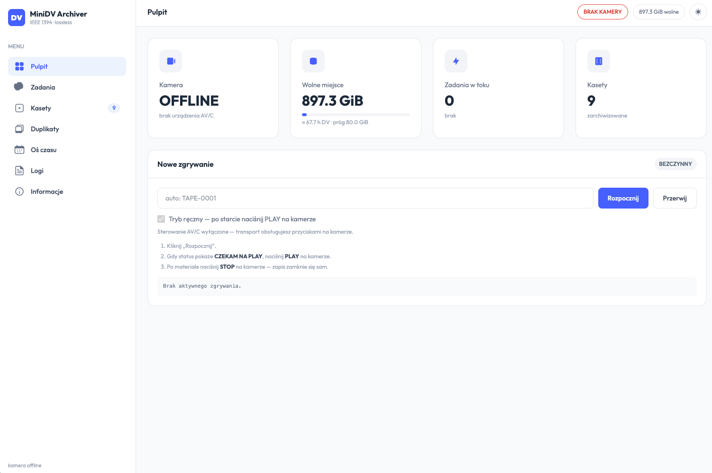
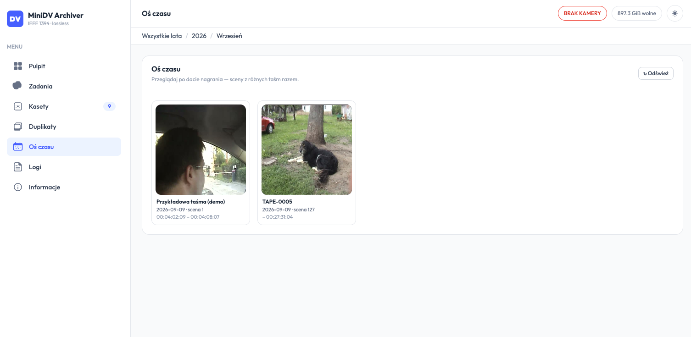

# MiniDV Archiver

[English](README.md) · **Polski**

Bezstratne zgrywanie i archiwizacja kaset MiniDV / DV przez FireWire (IEEE 1394),
z panelem WWW do przeglądania nagrań.

**Masterem jest zawsze surowy strumień DV** — zgrany przez `dvgrab`, pocięty na
sceny po przerwach timecode / daty nagrania na taśmie, zapisany jako `.dv`
skompresowany `zstd` i po kompresji zweryfikowany bajt‑po‑bajcie. Wszystko inne
(proxy H.264, plik podglądowy całej taśmy, miniatury, metadane JSON) to pochodne,
które można odtworzyć.

**Pulpit**



**Oś czasu** — rok → miesiąc → scena, jak w iPhone Photos



> UI jest po angielsku i po polsku (przełącznik w nagłówku). API i szczegółowe
> dokumenty w `docs/` są po angielsku. Pulpit to układ
> [TailAdmin](https://github.com/TailAdmin/tailadmin-free-tailwind-dashboard-template)
> (MIT) — zawendorowany w `frontend/vendor/`, więc **do uruchomienia nie trzeba
> nic budować**. Reszta konfigurowana zmiennymi środowiskowymi.

---

## Co robi

- **Zgrywa** surowy DV z dowolnej kamery / magnetowidu MiniDV z AV/C
  (`dvgrab -noavc`), z automatycznym sterowaniem transportem (PLAY/STOP/REW przez
  AV/C) albo w pełni ręcznie.
- **Wykrywanie końca taśmy** odporne na puste odcinki: czeka (i restartuje
  `dvgrab`, jeśli ten padnie na utracie sygnału) przez przerwy, kończy krótko po
  faktycznym końcu materiału i bezstratnie skleja segmenty.
- **Podział na sceny** po nieciągłościach DV (`dvgrab -autosplit`).
- **Zweryfikowana archiwizacja**: `sha256` surowej sceny, kompresja `zstd`,
  `zstd -t`, dekompresja strumieniowa i porównanie hasha — oryginalny `.dv` jest
  usuwany dopiero, gdy `.dv.zst` odtwarza go dokładnie.
- **Pochodne**: proxy MP4 H.264/AAC per scena, jeden ciągły `tape.mp4` (kopia
  strumienia proxy), miniatury i bogaty `*.json` (timecode, data nagrania z VAUX,
  przeplot, układ audio, znaczniki zgubionych klatek). Metadane kontenera
  (`creation_time`, tytuł, komentarz) stemplowane z taśmy, żeby pobrany plik dalej
  wiedział, skąd pochodzi.
- **Współbieżny pipeline**: zgrywanie trzyma slot FireWire na wyłączność; podział +
  kompresja + kodowanie idą w tle w kolejce, więc kolejną taśmę można zacząć, gdy
  poprzednia się jeszcze przetwarza.
- **Działa jako jeden proces albo cztery kontenery**: `grabber` (FireWire),
  `converter` (przetwarzanie / re-enkodowanie w tle), `api` (HTTP/JSON) i `ui`
  (`nginx`) koordynują się przez mały store SQLite (`state/jobs.db`), więc api da
  się zrestartować, a converter przenieść na inną maszynę bez przerywania
  zgrywania. Ten sam kod działa też jako pojedynczy proces. Zob.
  [`docs/ARCHITECTURE.md`](docs/ARCHITECTURE.md).
- **Pulpit**: status zgrywania na żywo, lista zadań w tle (zgrywania + re-enkodowania
  / sondy w kolejce) z logami, przeglądarka taśm z miniaturami scen, podgląd wideo
  w oknie, odtwarzanie całej taśmy z rozdziałami klik-do-przewinięcia, pobieranie
  (master `.dv.zst`, proxy, JSON). Angielski / polski, przełączane w nagłówku.
- **Oś czasu i metadane**: indeks per taśma/scena (odświeżany w tle) zasila
  przeglądarkę rok → miesiąc → scena w stylu iPhone Photos; zmiana nazwy taśm i
  edycja etykiet / dat nagrania z poziomu UI.
- **Wykrywanie duplikatów**: opcjonalna sonda jakości liczy per scena liczbę błędów
  dekodowania i odcisk treści; widok *Duplikaty* grupuje to samo nagranie z
  osobnych zgrań tej samej kasety i oznacza wersję z mniejszą liczbą błędów, żeby
  zostawić najczystszą, a resztę skasować.
- **Eksport „udostępnij"**: przycisk „⬇ FB" na żądanie re-enkoduje scenę (albo całą
  taśmę) do MP4 ~90 MB w tej samej rozdzielczości na Messengera/Facebooka i podaje
  gotowy plik. Tymczasowe, jedno na raz, auto-czyszczone.
- **Wariant „napraw"**: opcjonalny przycisk „🧹 Restore" buduje MP4 z
  odszumianiem/naprawą **dekodowany z mastera DV** (nie z proxy) — deinterlacing
  `bwdif` z wykrytą parzystością pól, potem `atadenoise` + `deblock` (cały łańcuch
  konfigurowalny przez `MINIDV_RESTORE_FILTERS`). Master i zwykłe proxy pozostają
  nietknięte.

Nigdy nie wysyła opcode'u `RECORD`. Taśma traktowana wyłącznie do odczytu.

## Wymagania

Host to zawsze **Linux ze stosem jądra `firewire_ohci` / `firewire_core`** i
działającym kontrolerem OHCI 1394 (`/dev/fw*`), plus kamera / magnetowid MiniDV z
portem DV/i.LINK, w trybie **PLAYER / VCR**.

- **Docker** (zalecane): Docker Engine + Compose. `dvgrab`, `ffmpeg`, `zstd`,
  `linux-firewire-utils` są w obrazie — nic więcej nie trzeba instalować.
- **Bare-metal**: Python **3.11+** (tylko biblioteka standardowa, bez zależności
  pip) oraz te narzędzia w `PATH`:

  ```bash
  sudo apt install dvgrab ffmpeg zstd linux-firewire-utils util-linux python3
  ```

## Szybki start (Docker)

```bash
git clone https://github.com/tomek10861/MiniDV-Archiver
cd MiniDV-Archiver
cp .env.example .env          # opcjonalnie; np. MINIDV_ALLOW_FCP=0 dla Sony DCR-PC2E
sudo mkdir -p /srv/minidv
docker compose up -d --build
# UI pod http://<host>:8088
```

Cztery kontenery współdzielą `/srv/minidv` (i jego `state/jobs.db`):

| usługa | kontener | robi |
|---|---|---|
| `grabber` | `privileged`, host `/dev` + `/sys` | trzyma FireWire, uruchamia `dvgrab` |
| `converter` | — | podział na sceny, zstd + weryfikacja bajtowa, proxy, re-enkodowania, sondy jakości |
| `api` | `expose: 8080` (nie publikowany) | HTTP/JSON; czyta system plików + store |
| `ui` | `nginx`, publikuje `:8088` | serwuje `frontend/`, proxuje `/api` → `api:8080` |

Dowolną z nich zrestartujesz bez ruszania reszty (`docker compose restart api`).
Port publikuje tylko `ui` — **nie ma uwierzytelniania**, więc zablokuj `:8088`
firewallem do zaufanej sieci. `grabber` jest `privileged`, bo węzeł `/dev/fw*`
kamery jest hot-plugowany; on oraz api/converter montują host `/sys` tylko do
odczytu, żeby `camera.info()` mogło rozwiązać węzeł FireWire.

### Inne sposoby uruchomienia

```bash
sudo ./scripts/install.sh            # systemd, jeden proces na :8080
sudo ./scripts/install.sh --split    # systemd, bare-metal grabber + converter + api + nginx
MINIDV_STORAGE=$HOME/minidv python3 -m minidv_archiver.server   # bez instalacji, jeden proces
```

`scripts/install.sh` kopiuje aplikację do `/opt/minidv-archive`, instaluje regułę
udev (`systemd/99-minidv-firewire.rules`) i unit(y), po czym je uruchamia;
konfigurację edytuj w `/etc/minidv-archive.env`. Unity systemd w wariancie split
i bare-metalowy konfig nginx (`deploy/nginx-minidv.conf`) to odpowiednik czterech
kontenerów bez Dockera — zob. [`docs/ARCHITECTURE.md`](docs/ARCHITECTURE.md).

## Konfiguracja

Wszystko przez zmienne środowiskowe — pełna lista z domyślnymi w
[`.env.example`](.env.example). Te, które najczęściej ruszysz:

Przy Dockerze wpisz je do `.env` (compose je czyta). Przy systemd idą do
`/etc/minidv-archive.env`.

| Zmienna | Domyślnie | Znaczenie |
|---|---|---|
| `MINIDV_STORAGE` | `/srv/minidv` | katalog główny archiwum (bind-mount do każdego kontenera) |
| `MINIDV_CAMERA_GUID` | *(auto)* | puste = pierwsze urządzenie taśmowe AV/C na magistrali; ustaw GUID, gdy podłączonych jest kilka |
| `MINIDV_ALLOW_FCP` | `1` | `1` = transport przez AV/C; `0` = ręczne PLAY/STOP na kamerze |
| `MINIDV_MP4_PRESET` | `medium` | preset x264 dla proxy (`veryfast` ~4–6× szybszy, większe pliki) |
| `MINIDV_SHARE_MAX_MB` | `90` | docelowy rozmiar re-enkodu „udostępnij" |
| `MINIDV_RESTORE_FILTERS` | `bwdif…,atadenoise,deblock…` | łańcuch `-vf` ffmpeg dla wariantu „napraw" |
| `MINIDV_INDEX_INTERVAL` | `300` | sekundy między odświeżeniami indeksu taśm/scen w tle |
| `MINIDV_BIND` / `MINIDV_PORT` | `0.0.0.0` / `8080` | nasłuch HTTP api (wewnątrz kontenera) |

## Użycie

1. Włóż kasetę, przełącz kamerę na **PLAYER / VCR**, podłącz FireWire.
2. Otwórz pulpit (`:8088` przy Dockerze, `:8080` w trybie jednoprocesowym) →
   **New capture** → *Start* (id taśmy nadawane automatycznie, np. `TAPE-0001`).
3. **Tryb auto** (`MINIDV_ALLOW_FCP=1`): sam przewija i wciska PLAY.
   **Tryb ręczny**: poczekaj na `WAITING FOR PLAY`, wciśnij **PLAY** na kamerze;
   po materiale wciśnij **STOP** (albo zatrzyma się sam po limicie pustego ogona).
4. Zgrywanie przechodzi do pipeline'u w tle; kolejną taśmę zaczynasz kiedy chcesz.
   Wyniki przeglądasz w **Tapes** / **Timeline**.

### CLI

```bash
python3 -m minidv_archiver.cli camera status        # transport AV/C + timecode
python3 -m minidv_archiver.cli camera play|stop     # tylko gdy MINIDV_ALLOW_FCP=1
python3 -m minidv_archiver.cli process take.dv --tape-id TAPE-0007   # wciągnij istniejący .dv
python3 -m minidv_archiver.cli serve                # jeden proces (capture + converter + api)
python3 -m minidv_archiver.cli grabber              # split: samo zgrywanie FireWire
python3 -m minidv_archiver.cli converter            # split: przetwarzanie / re-enkodowania w tle
python3 -m minidv_archiver.cli api                  # split: samo HTTP/JSON
```

### Weryfikacja / odtworzenie mastera

```bash
zstd -t 0001_*.dv.zst                       # integralność archiwum
zstd -dc 0001_*.dv.zst > recovered.dv       # dokładny surowy DV z powrotem
sha256sum -c tape.sha256                    # każdy plik w katalogu taśmy
```

Kompletne przykładowe archiwum (jedna prawdziwa ~6 s scena, ~20 MB) jest w
[`examples/demo-tape/`](examples/demo-tape/) — skopiuj je do
`$MINIDV_STORAGE/tapes/`, żeby zobaczyć w pulpicie.

## API

JSON po HTTP (serwuje proces `api`; `nginx` proxuje do niego `/api`).

**`GET`**
`/api/status` · `/api/storage` · `/api/jobs` · `/api/jobs/{id}` ·
`/api/tapes` (z indeksu) · `/api/tapes/{id}` · `/api/tapes/{id}/scenes` ·
`/api/tapes/{id}/scenes/{scene_id}` ·
`/api/timeline` · `/api/timeline/{rok}/{miesiąc}` · `/api/duplicates` ·
`/api/tapes/{id}/files/{name}` (pliki archiwum; `Range` dla MP4; `?dl=1` wymusza
pobranie) ·
`/api/tapes/{id}/compressed/{token}.mp4` — serwuje build na żądanie; `token` to
`TAPE`, `<scene_id>`, `<scene_id>-RES` (napraw), albo `SEL-<hash>[-FB|-RES]` ·
`/api/playlist/build/{token}.mp4` — serwuje build złożony ze scen z kilku kaset (niżej).

**`POST`**
`/api/capture/start` `{tape_id?, rewind?, duration?, manual_transport?}` ·
`/api/capture/stop` `{tape_id?}` ·
`/api/tape/{play,stop,rewind}` (409, jeśli `MINIDV_ALLOW_FCP` != 1) ·
`/api/tapes/{id}/scenes/{scene}/compress` `{restore?}` ·
`/api/tapes/{id}/compress` `{scenes?, share?, restore?}` (brak body = cała taśma) ·
`/api/tapes/{id}/rename` `{new_id}` ·
`/api/tapes/{id}/meta` `{label?, recording_date?}` ·
`/api/tapes/{id}/reprobe` `{force?}` (sonda jakości / odcisk) ·
`/api/playlist/build` `{items: [{tape_id, scene_id}, ...], title?}` — złącza sceny
z jednej lub kilku kaset (w podanej kolejności) w jedno MP4, np. z zaznaczenia na osi
czasu. Wywołaj ponownie z tym samym body, żeby odpytać status
(`QUEUED`/`RUNNING`/`READY`) — ten sam wzorzec co pozostałe buildy na żądanie.

**`DELETE`**
`/api/tapes/{id}` · `/api/tapes/{id}/scenes` `{scenes: [...]}` ·
`/api/jobs/{tape_id}` (kasuje wpis ukończonego/błędnego zadania; odmawia dla
działającego albo już zarchiwizowanego).

## Zgodność kamer i uwagi o FireWire

> **⚠ Okablowanie — przejściówka 6-pin ↔ 4-pin potrafi spalić złącze.** Wtyk
> FireWire 6-pin niesie zasilanie magistrali (~8–30 V); wtyk i.LINK 4-pin nie.
> Tania albo źle zrobiona przejściówka 6→4, albo wpięcie jej „na gorąco", może
> podać zasilanie na port, który nie miał go dostać, i **fizycznie spalić złącze
> FireWire w kamerze albo w PC** (tu tak padła stara kamera). Zasady:
>
> - **PC wyłączony** → najpierw wepnij wtyk **6-pin** do PC.
> - **Kamera wyłączona** → wepnij wtyk **4-pin** do kamery.
> - Dopiero potem włącz oba. **Nigdy nie wpinaj żadnego końca na gorąco.**
> - Jeśli karta w PC ma port 4-pin, wolij zwykły kabel **4-pin ↔ 4-pin**, albo
>   sprawdzoną przejściówkę; unikaj najtańszych.

Większość magnetowidów i kamer DV działa przez AV/C bez problemu. Część starszych
PHY i.LINK jest na granicy: odpadają z magistrali albo ją resetują przy
transakcjach FCP. Jeśli tak masz:

- Ustaw `MINIDV_ALLOW_FCP=0` i steruj PLAY/STOP ręcznie.
- Zresetuj kamerę prądowo (wyciągnij zasilacz na ~30–60 s), żeby odblokować
  zawieszony PHY — w oprogramowaniu się tego nie da.
- Trzymaj kontroler FireWire i ewentualny mostek PCIe-do-PCI poza runtime PM
  (`ATTR{power/control}="on"`) — `systemd/99-minidv-firewire.rules` ma przykład
  pod VIA VT6306 + ASMedia ASM1083.

**Sony DCR-PC2E** to przerobiony przykład wszystkiego powyższego; zob.
[`docs/FIREWIRE.md`](docs/FIREWIRE.md).

Więcej dokumentów (po angielsku): [architektura](docs/ARCHITECTURE.md) ·
[format archiwum](docs/ARCHIVE_FORMAT.md) · [metadane DV](docs/DV_METADATA.md) ·
[magazyn](docs/STORAGE.md).

## Rozwój

```bash
python3 -m pip install -e ".[dev]"
python3 -m pytest -q
```

Tylko biblioteka standardowa; aplikacja rozmawia z `dvgrab` / `ffmpeg` / `zstd`
jako podprocesami. Obraz kontenera przebudowujesz przez
`docker compose up -d --build` po każdej zmianie kodu.

Front to `frontend/index.html` + `frontend/app.js` + `frontend/i18n.js` (czysty JS,
angielski/polski) z zawendorowanym CSS TailAdmin. Po edycji znaczników lub klas
przebuduj CSS:

```bash
scripts/build-css.sh          # potrzebuje Node + npm; nadpisuje frontend/vendor/tailadmin.css
```

Zewnętrzne zasoby frontu i ich licencje wypisane w
[`frontend/vendor/README.md`](frontend/vendor/README.md).

## Licencja

MIT — zob. [LICENSE](LICENSE).
